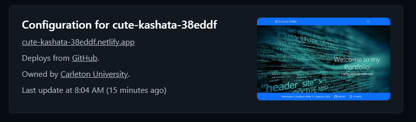

b

	
	
	
	
	
	

# Carlton Coding Bootcamp Certification

	
Table of Contents

	<ol>
		<li><a href="#Description">React Portfolio</a></li>
		<li><a href="#installation">Installation</a></li>		
		<li><a href="#usage">Application Usage</a></li>
          <li><a href="#publishing">Hosting Website - Netlify</a></li>
		<li><a href="#contactme">Questions? Contact Me!</a></li>
          <li><a href="#license">License</a></li>
	</ol>

## React Portfolio

For the past few weeks we have been learning about React. Myself coming from a Dot.NET Microsoft framework, it has been challenging for me. Nevertheless, I was able to understand the process and develop this application. The React Portfolio application was developed entirely using React (and other related libraries) and Vite. My goal is to demonstrate possible employers how much and quick I have learned and how quick I can develop a single-page application in react.

React is a free and open-source front-end JavaScript library for building user interfaces based on components. A library not a framework. It is maintained by a community of individual developers and companies.

React can be used to develop single-page, mobile, or server-rendered applications with frameworks like Next.js. Because React is only concerned with the user interface and rendering components to the DOM, React applications often rely on libraries for routing and other client-side functionality. A key advantage of React is that it only rerenders those parts of the page that have changed, avoiding unnecessary rerendering of unchanged DOM elements.

Here is my product!

	

(<a href="#readme-top">back to top</a>)

## Installation

The JATE (Just Another Text Editor) requires two tiers; Server and client. Each one requires their own independant dependancies. Please follow the instructions to install the JATE application

|Name|Description |
|---|---|
|[wow-portfolio][wowportfolio]| Navigate to WOW React Portfolio github repo and clone application. |
|[install-dependancies][]| Once main depandancies have been installed then run this script: `npm run install` |
|[build-develop][] | Run script `npm run build`. This script will compile and create the application, it generates the `dist` folder with all components. |
|[dev][] | Once application has been built we can run script `npm run dev` to execute application. |

[wowportfolio]: https://github.com/gusmiller/WOW_React_Portfolio
[main-dependancies]: main-dependacies
[install-dependancies]: install-dependacies
[build-develop]: build-develop
[dev]: start

**NOTE** the application should be deployed into Netlify. You can review their [documentation](https://vitejs.dev/guide/static-deploy.html#netlify) for further details.

	
Once you have installed the dependancies and build he application you should have a screen like the following. (click on arrow to expand)

	

	     
     

### List of application and developing dependencies

To specify the packages your project depends on, you must list them as "dependencies" or "devDependencies" in your package's package.json file. When you (or another user) run npm install, npm will download dependencies and devDependencies that are listed in package.json that meet the semantic version requirements listed for each.

Application dependencies:

> bootstrap - version 5.2.3 
> font-awesome - version 4.7.0 
> react - version 18.2.0 
> react-dom - version 18.2.0 
> react-router-dom - version 6.11.1 
> @primer/octicons-react - version 19.8.0 
 

Development Dependencies (devDependencies):

> @types/react - version 18.0.28 
> @types/react-dom - version 18.0.11 
> @vitejs/plugin-react - version 4.0.0 
> vite - version 4.3.2 

(<a href="#readme-top">back to top</a>)

## Application Usage

My Personal Portfolio is self-explanatory and easy to navigate. It allows users to review the latest applications I have designed. There isn't much to it. The list of websites is stored in a plain text file, since there is no database implemented, but very easily it can be done. The contact form allows user to send (in therory) a message to the owner, but functionality has not been implemented. 

User is able to download a copy of my resume for further review. You may download a copy of my resume [here](http://miller-hs.com/Images/documents/233ad29b-4ee3-4ccc-b108-ef62cd269b83_gustavo%20miller@miller-hs.pdf)

(<a href="#readme-top">back to top</a>)

## Hosting Website - Netlify

There are hundreds of static website hosts companies; for this assignment we are using Netlify. Netlify makes it super easy for developers to host websites, in a way that is scalable and secure, very quicly and much less effort we can make our websites ready for the world to see. Netlify leverages serverless functions and deployment to deliver sites faster than other configurations. Through Jamstack architecture, the infrastructure is suited for both developers and content editors.

### Status Badges
Status badges are visual representations of your site’s status, served as image files you can add to repository READMEs, documentation, or any other web page.

The following image automatically updates to reflect the current state of my latest production deploy. 

Once the application is deployed into Netlify it will available to the world. Take a look at my [Wow! Portfolio](https://main--cute-kashata-38eddf.netlify.app/)

(<a href="#readme-top">back to top</a>)

## Questions? Contact Me 

The purpose of this React Portfolio is to demonstrate possible employeers what I can achive with the new skills I have learned at Carleton Coding Bootcamp. The application was developed in React singl-page concept.

Do not hesitate in contacting me, Gustavo Miller - gustavo.miller@miller-hs.com.

You may find the application at: [https://github.com/gusmiller/WOW_React_Portfolio](https://github.com/gusmiller/WOW_React_Portfolio)

(<a href="#readme-top">back to top</a>)

## License

Free and Unencumbered Software

Copyright (c) 2024 Wow React Portfolio

Anyone is free to copy, modify, publish, use, compile, sell, or distribute this software, either in source code form or as a compiled binary, for any purpose, commercial or non-commercial, and by any means.

In jurisdictions that recognize copyright laws, the author or authors of this software dedicate any and all copyright interest in the software to the public domain. We make this dedication for the benefit of the public at large and to the detriment of our heirs and successors. We intend this dedication to be an overt act of relinquishment in perpetuity of all present and future rights to this software under copyright law.

THE SOFTWARE IS PROVIDED "AS IS", WITHOUT WARRANTY OF ANY KIND, EXPRESS OR IMPLIED, INCLUDING BUT NOT LIMITED TO THE WARRANTIES OF MERCHANTABILITY, FITNESS FOR A PARTICULAR PURPOSE AND NONINFRINGEMENT. IN NO EVENT SHALL THE AUTHORS BE LIABLE FOR ANY CLAIM, DAMAGES OR OTHER LIABILITY, WHETHER IN AN ACTION OF CONTRACT, TORT OR OTHERWISE, ARISING FROM, OUT OF OR IN CONNECTION WITH THE SOFTWARE OR THE USE OR OTHER DEALINGS IN THE SOFTWARE.

For more information, please refer to <https://unlicense.org>

(<a href="#readme-top">back to top</a>)

---
© 2023 edX Boot Camps LLC. Confidential and Proprietary. All Rights Reserved. Developed by Gustavo Miller.